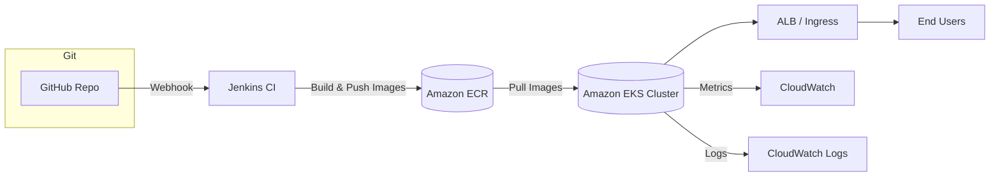

# MERN Application – Full Deployment Guide (AWS ECR + Jenkins CI/CD + EKS + Helm + CloudWatch)

This **README.md** provides the complete deployment documentation for a production-grade MERN application on AWS using:

- **Dockerized Frontend (React) & Backend (Node/Express)**
- **Amazon ECR** for container registry
- **Jenkins CI/CD** for automated build & push
- **Amazon EKS** as the Kubernetes cluster
- **Helm** for application deployment
- **CloudWatch** for monitoring and logging

This guide describes **architecture**, **setup steps**, **commands**, and **folder structure** so you can publish this in your GitHub repository.

---

# 📌 Table of Contents
1. [Architecture Overview](#architecture-overview)
2. [Repository Structure](#repository-structure)
3. [Prerequisites](#prerequisites)
4. [Step 1 – Application Containerization](#step-1--application-containerization)
5. [Step 2 – Push Docker Images to ECR](#step-2--push-docker-images-to-ecr)
6. [Step 3 – AWS Environment Setup](#step-3--aws-environment-setup)
7. [Step 4 – Jenkins CI/CD Setup](#step-4--jenkins-cicd-setup)
8. [Step 5 – EKS Cluster Creation (eksctl)](#step-5--eks-cluster-creation-eksctl)
9. [Step 6 – Helm Deployment](#step-6--helm-deployment)
10. [Step 7 – Monitoring & Logging](#step-7--monitoring--logging)
11. [Step 8 – Scripts](#step-8--scripts)
12. [Troubleshooting](#troubleshooting)


---

# 🏗 Architecture Overview


---

# 📁 Repository Structure
```
project-root/
├── frontend/
│   ├── Dockerfile
│   ├── nginx.conf
│   └── .dockerignore
├── backend/
│   ├── Dockerfile
│   └── .dockerignore
├── helm/mern-chart/
│   ├── Chart.yaml
│   ├── values.yaml
│   └── templates/
├── scripts/
│   ├── build_and_push.sh
│   └── build_and_push.ps1
├── Jenkinsfile
└── README.md (this file)
```

---

# Step 1 – Application Containerization

## **Frontend Dockerfile (React + Nginx)**
```dockerfile
FROM node:18-alpine AS build
WORKDIR /app
COPY package*.json ./
RUN npm ci
COPY . .
RUN npm run build

FROM nginx:stable-alpine
COPY --from=build /app/build /usr/share/nginx/html
EXPOSE 80
CMD ["nginx", "-g", "daemon off;"]
```

## **Backend Dockerfile (Node/Express)**
```dockerfile
FROM node:18-alpine
WORKDIR /usr/src/app
COPY package*.json ./
RUN npm ci --only=production
COPY . .
EXPOSE 3000
CMD ["node", "server.js"]
```

---

# Step 2 – Push Docker Images to ECR
### Create ECR repositories
```bash
aws ecr create-repository --repository-name my-frontend-repo --region ap-south-1
aws ecr create-repository --repository-name my-backend-repo  --region ap-south-1
```

### Authenticate Docker to ECR
```bash
aws ecr get-login-password --region ap-south-1 | \
docker login --username AWS --password-stdin <ACCOUNT_ID>.dkr.ecr.ap-south-1.amazonaws.com
```

### Build & push images
```bash
docker build -t my-frontend ./frontend
docker tag my-frontend:latest <ACCOUNT_ID>.dkr.ecr.ap-south-1.amazonaws.com/my-frontend-repo:latest
docker push <ACCOUNT_ID>.dkr.ecr.ap-south-1.amazonaws.com/my-frontend-repo:latest

# Backend
docker build -t my-backend ./backend
docker tag my-backend:latest <ACCOUNT_ID>.dkr.ecr.ap-south-1.amazonaws.com/my-backend-repo:latest
docker push <ACCOUNT_ID>.dkr.ecr.ap-south-1.amazonaws.com/my-backend-repo:latest
```

---

# Step 3 – AWS Environment Setup
### Install AWS CLI (Linux/macOS/Windows supported)
```bash
aws configure
```
Add:
- Access Key
- Secret Key
- Region: `ap-south-1`
- Output: `json`

Verify:
```bash
aws sts get-caller-identity
```

---

# Step 4 – Jenkins CI/CD Setup

### Install Jenkins on EC2
```bash
sudo apt update
sudo apt install openjdk-17-jdk -y
sudo apt install jenkins -y
```
Access Jenkins:  
`http://<EC2_PUBLIC_IP>:8080`

### Install required plugins
- Pipeline
- Git
- Docker Pipeline
- Credentials
- AWS Credentials
- Amazon ECR

### Jenkinsfile (CI/CD pipeline)
```groovy
pipeline {
  agent any
  environment {
    AWS_REGION = 'ap-south-1'
    FRONTEND_REPO = 'my-frontend-repo'
    BACKEND_REPO  = 'my-backend-repo'
  }
  stages {
    stage('Checkout') { steps { checkout scm } }

    stage('Login to ECR') {
      steps {
        sh "aws ecr get-login-password --region ${AWS_REGION} | docker login --username AWS --password-stdin <ACCOUNT_ID>.dkr.ecr.${AWS_REGION}.amazonaws.com"
      }
    }

    stage('Build & Push Frontend') {
      steps {
        dir('frontend') {
          sh "docker build -t ${FRONTEND_REPO}:latest ."
          sh "docker tag ${FRONTEND_REPO}:latest <ACCOUNT_ID>.dkr.ecr.${AWS_REGION}.amazonaws.com/${FRONTEND_REPO}:latest"
          sh "docker push <ACCOUNT_ID>.dkr.ecr.${AWS_REGION}.amazonaws.com/${FRONTEND_REPO}:latest"
        }
      }
    }

    stage('Build & Push Backend') {
      steps {
        dir('backend') {
          sh "docker build -t ${BACKEND_REPO}:latest ."
          sh "docker tag ${BACKEND_REPO}:latest <ACCOUNT_ID>.dkr.ecr.${AWS_REGION}.amazonaws.com/${BACKEND_REPO}:latest"
          sh "docker push <ACCOUNT_ID>.dkr.ecr.${AWS_REGION}.amazonaws.com/${BACKEND_REPO}:latest"
        }
      }
    }
  }
}
```

### Configure Webhook in GitHub
- Go to Repository → Settings → Webhooks → Add webhook
- Payload URL: `http://<JENKINS_URL>/github-webhook/`
- Content type: `application/json`
- Trigger: Push events

---

# Step 5 – EKS Cluster Creation (eksctl)
```bash
eksctl create cluster \
  --name mern-cluster \
  --region ap-south-1 \
  --node-type t3.medium \
  --nodes 2 \
  --managed
```
Verify:
```bash
kubectl get nodes
```

---

# Step 6 – Helm Deployment

### File: `helm/mern-chart/values.yaml`
```yaml
frontend:
  image: <ACCOUNT_ID>.dkr.ecr.ap-south-1.amazonaws.com/my-frontend-repo:latest
backend:
  image: <ACCOUNT_ID>.dkr.ecr.ap-south-1.amazonaws.com/my-backend-repo:latest
```

### Deploy using Helm
```bash
helm install mern-app helm/mern-chart -n mern
```

Check pods:
```bash
kubectl get pods -n mern
```

---

# Step 7 – Monitoring & Logging

### Enable EKS Control Plane Logs
```bash
aws eks update-cluster-config --name mern-cluster --region ap-south-1 \
  --logging '{"clusterLogging":[{"types":["api","audit","authenticator","controllerManager","scheduler"],"enabled":true}]}'
```

### Deploy CloudWatch Agent + Fluent Bit
```bash
kubectl apply -f https://raw.githubusercontent.com/aws/amazon-cloudwatch-agent/main/k8s-deployment-manifest.yaml
kubectl apply -f https://raw.githubusercontent.com/aws/amazon-cloudwatch-container-insights/main/deployment-eks-k8s-1.16/fluent-bit/fluent-bit.yaml
```
Logs appear under:
```
/aws/containerinsights/mern-cluster/application
```

---

# Step 8 – Scripts

### Linux/macOS Script: `scripts/build_and_push.sh`
```bash
#!/bin/bash
REGION="ap-south-1"
ACCOUNT=$(aws sts get-caller-identity --query Account --output text)
aws ecr get-login-password --region $REGION | docker login --username AWS --password-stdin $ACCOUNT.dkr.ecr.$REGION.amazonaws.com

docker build -t my-frontend ./frontend
docker tag my-frontend:latest $ACCOUNT.dkr.ecr.$REGION.amazonaws.com/my-frontend-repo:latest

